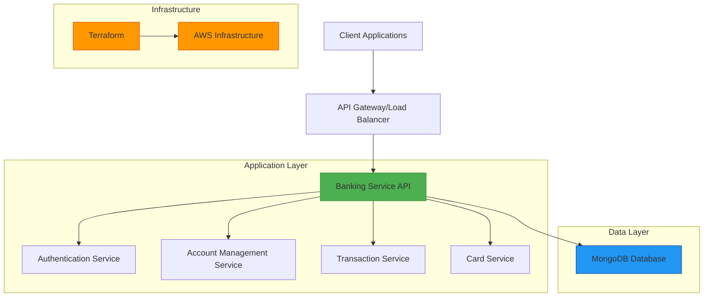

# Banking Service Architecture

## Overview
This document provides a high-level overview of the banking service architecture, illustrating the components and their interactions.

## Architecture Diagram

## Component Descriptions

### Client Applications
External applications that interact with the banking service, including web browsers, mobile apps, and third-party integrations.

### API Gateway/Load Balancer
Entry point for all API requests, responsible for:
- Request routing
- Load distribution
- SSL termination
- Rate limiting
- Authentication validation

### Banking Service API
Main application server built with Node.js and Express, containing all business logic and orchestrating interactions between services.

#### Authentication Service
Handles user registration, login, and token management:
- User credential validation
- JWT token generation and validation
- Password hashing and verification

#### Account Management Service
Manages bank accounts and related operations:
- Account creation and closure
- Account status updates
- Balance inquiries

#### Transaction Service
Handles financial transactions:
- Money transfers between accounts
- Transaction history tracking
- Balance updates

#### Card Service
Manages payment cards:
- Card issuance and activation
- Card status management
- Spending limit controls

### MongoDB Database
Primary data store for all banking service data:
- User profiles
- Account information
- Transaction records
- Card details

### Terraform
Infrastructure as Code tool used to provision and manage AWS resources consistently and reproducibly.

### AWS Infrastructure
Cloud infrastructure components provisioned by Terraform:
- Virtual Private Cloud (VPC)
- Subnets (public and private)
- Security groups
- Networking components

## Data Flow

1. **User Registration/Login**
   - Client sends credentials to API Gateway
   - Request routed to Authentication Service
   - Credentials validated and JWT token generated
   - Token returned to client for subsequent requests

2. **Account Operations**
   - Client sends authenticated requests to API Gateway
   - Request routed to Account Management Service
   - Service validates permissions and processes request
   - Data persisted to MongoDB
   - Response returned to client

3. **Transaction Processing**
   - Client initiates transfer request
   - Transaction Service validates accounts and balances
   - Atomic transaction executed (withdrawal from source, deposit to destination)
   - Transaction recorded in database
   - Updated balances returned to client

4. **Card Management**
   - Client requests card operations
   - Card Service processes requests
   - Card data managed in database
   - Status updates communicated to client

## Security Considerations

### Network Security
- Private subnet isolation for database tier
- Security groups restricting access between tiers
- SSL/TLS encryption for all data in transit

### Application Security
- JWT-based authentication for all protected endpoints
- Password hashing with bcrypt
- Input validation and sanitization
- Role-based access control

### Data Security
- Encryption at rest for sensitive data
- Regular backups with encryption
- Audit logging for all financial transactions
- Secure key management with AWS Secrets Manager

## Scalability Features

### Horizontal Scaling
- Stateless API design allows for multiple instances
- Load balancing distributes requests across instances
- Database connection pooling optimizes resource usage

### Database Scaling
- Indexing strategies for performance
- Read replicas for reporting queries
- Sharding capability for high-volume collections

### Infrastructure Scaling
- Auto Scaling Groups for dynamic capacity adjustment
- CloudWatch monitoring for performance metrics
- Elastic Load Balancing for traffic distribution

## Monitoring and Observability

### Logging
- Structured application logs
- Database query logging
- Infrastructure event logging

### Metrics
- API response times and throughput
- Database performance metrics
- Infrastructure resource utilization

### Alerting
- Threshold-based alerts for critical metrics
- Notification systems for operational events
- Automated incident response procedures